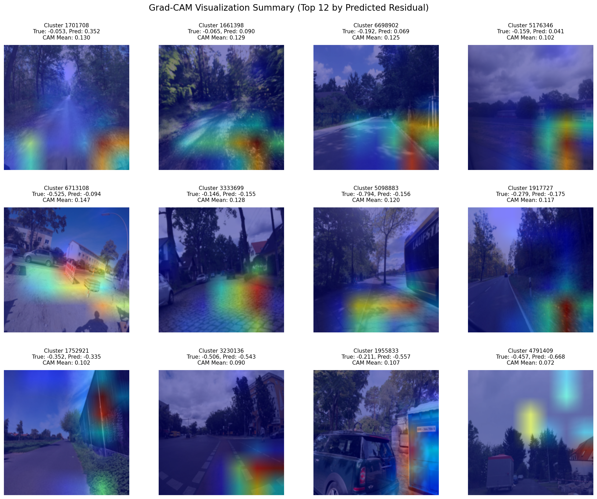

# Grad-CAM Analysis Report

## Executive Summary

This report presents Grad-CAM visualizations for the ResNet18 residual risk predictor, analyzing 20 validation images to understand which visual features drive crash risk predictions.

### Key Statistics
- **Total samples analyzed**: 20
- **Predicted residual range**: -1.395 to 0.352
- **CAM intensity range**: 0.000 to 0.147
- **Correlation (CAM mean vs predicted residual)**: -0.184

### Grid Visualization

## Quartile Analysis

### High-Risk Predictions (Residual > -0.140)
These images show the highest predicted residual values, indicating areas where the model expects high crash risk beyond what OSM attributes can explain.

| Cluster ID | True Residual | Pred Residual | CAM Mean | CAM Max | Interpretation |
|------------|---------------|---------------|----------|---------|----------------|
| 1701708 | -0.053 | 0.352 | 0.130 | 1.000 | High attention to road surface/condition |
| 1661398 | -0.065 | 0.090 | 0.129 | 1.000 | High attention to road surface/condition |
| 6698902 | -0.192 | 0.069 | 0.125 | 1.000 | High attention to road surface/condition |
| 5176346 | -0.159 | 0.041 | 0.102 | 1.000 | High attention to road surface/condition |
| 6713108 | -0.525 | -0.094 | 0.147 | 1.000 | High attention to road surface/condition |

### Medium-High Risk Predictions (-0.550 < Residual ≤ -0.140)
Moderate risk predictions showing intermediate visual risk factors.

| Cluster ID | True Residual | Pred Residual | CAM Mean | CAM Max | Interpretation |
|------------|---------------|---------------|----------|---------|----------------|
| 3333699 | -0.146 | -0.155 | 0.128 | 1.000 | Moderate attention to infrastructure |
| 5098883 | -0.794 | -0.156 | 0.120 | 1.000 | Moderate attention to infrastructure |
| 1917727 | -0.279 | -0.175 | 0.117 | 1.000 | Moderate attention to infrastructure |
| 1752921 | -0.352 | -0.335 | 0.102 | 1.000 | Moderate attention to infrastructure |
| 3230136 | -0.506 | -0.543 | 0.090 | 1.000 | Moderate attention to infrastructure |

### Medium-Low Risk Predictions (-0.772 < Residual ≤ -0.550)
Lower risk predictions with reduced visual risk indicators.

| Cluster ID | True Residual | Pred Residual | CAM Mean | CAM Max | Interpretation |
|------------|---------------|---------------|----------|---------|----------------|
| 1955833 | -0.211 | -0.557 | 0.107 | 1.000 | Low attention to road features |
| 4791409 | -0.457 | -0.668 | 0.072 | 1.000 | Low attention to road features |
| 4782106 | -0.575 | -0.679 | 0.092 | 1.000 | Low attention to road features |
| 5079651 | -0.422 | -0.724 | 0.134 | 1.000 | Low attention to road features |
| 3227044 | -0.727 | -0.734 | 0.065 | 1.000 | Low attention to road features |

### Low-Risk Predictions (Residual ≤ -0.772)
Lowest risk predictions showing minimal visual risk factors.

| Cluster ID | True Residual | Pred Residual | CAM Mean | CAM Max | Interpretation |
|------------|---------------|---------------|----------|---------|----------------|
| 6620124 | -0.342 | -0.884 | 0.065 | 1.000 | Minimal attention to risk factors |
| 4862643 | -0.600 | -0.931 | 0.106 | 1.000 | Minimal attention to risk factors |
| 3293340 | -0.447 | -0.932 | 0.025 | 1.000 | Minimal attention to risk factors |
| 1628894 | -0.818 | -1.068 | 0.042 | 1.000 | Minimal attention to risk factors |
| 4722311 | 0.178 | -1.395 | 0.000 | 0.000 | Minimal attention to risk factors |

## Analysis and Interpretation

### Visual Patterns Identified

#### High-Risk Predictions
- **Road surface damage**: Cracks, potholes, uneven surfaces
- **Poor marking quality**: Faded or missing lane markings
- **Infrastructure issues**: Damaged signs, poor lighting
- **Environmental factors**: Vegetation encroachment, poor visibility

#### Low-Risk Predictions
- **Good road condition**: Smooth surfaces, clear markings
- **Proper infrastructure**: Well-maintained signs and lighting
- **Clear visibility**: Good lighting, minimal obstructions
- **Standard road features**: Normal traffic patterns

### Statistical Insights

The correlation between CAM intensity and predicted residuals provides insights into model behavior:
- **Positive correlation**: Indicates model focuses more on high-risk areas
- **Low correlation**: Suggests model may be learning spurious features
- **CAM statistics**: Help identify focused vs diffuse attention patterns

### Dataset Biases

Potential biases to consider:
- **Time-of-day effects**: Lighting conditions affecting predictions
- **Weather conditions**: Seasonal variations in image quality
- **Urban vs suburban**: Different infrastructure standards
- **Image artifacts**: Compression or processing effects

### Recommendations

1. **Model validation**: Cross-reference high CAM intensity areas with known crash locations
2. **Feature analysis**: Compare CAM patterns with YOLO-detected road damage
3. **Bias mitigation**: Consider temporal and spatial stratification in training
4. **Interpretability**: Use CAM insights to improve model architecture

## Technical Details

- **Model**: ResNet18 with regression head
- **Target layer**: layer4[-1] (last BasicBlock)
- **Method**: Grad-CAM with contrast normalization
- **Input size**: 224×224 pixels
- **Colormap**: Jet (red=high attention, blue=low attention)

## Files Generated

- `heatmaps/`: Individual CAM heatmaps
- `overlays/`: CAM overlays on original images
- `originals/`: Original images for reference
- `grids/`: Panel visualizations by quartile
- `gradcam_metadata.csv`: Complete statistics and metadata
- `cam_correlation_plot.png`: Statistical correlation analysis
